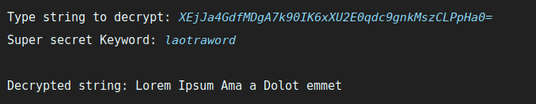

JSecretStrings
==============

A tool for encryption and decryption of Strings through native Java JCA (Java Cryptography Architecture) classes
and optionally using custom security layers (Basic funny tricks) on top of Standard Cryptography Architecture.

## Use cases
Wherever that an application manipulates sensible/critical information, you can
easily securing the information by encrypt/decrypt messages from origin-to-receptor points.

This is designed to be used as a library into another applications, and allows to encrypt
with standard JCA algorithms and using another custom algorithms.

## About the code
You can check: ```org.jsecretstrings.core``` package which is where all magic happens.<br/>
The ```org.jsecretstring.frontend.ConsoleClient``` class is a frontend to encrypt and decrypt
strings on console. Use to test or quickly encrypt/descrypt messages:




## About a Graphic Client.
Only like a funny experiment, a Graphic Client(JavaFX) is available running from
class: ```org.jsecretstring.frontend.FXClient```.


## Author.

 * Giovanni Aguirre | [@DiganmeGiovanni](http://twitter.com/DiganmeGiovanni)
